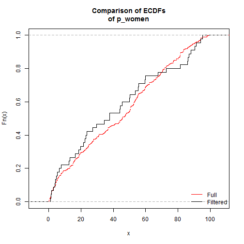
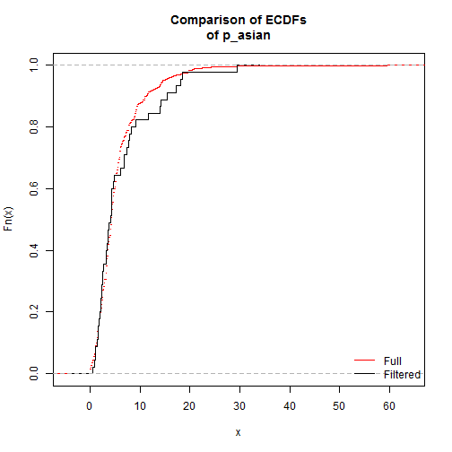
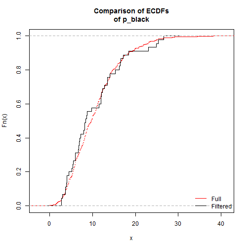
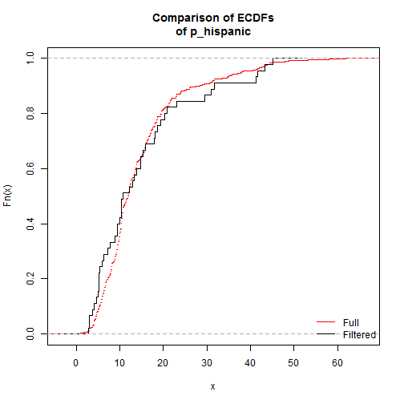
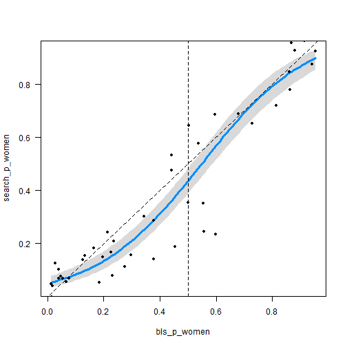
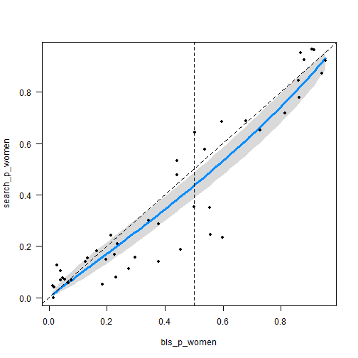
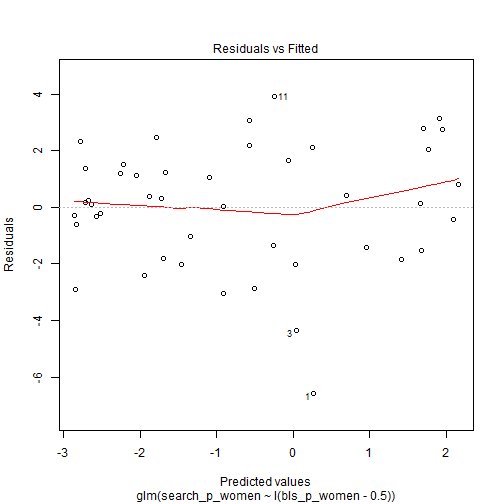
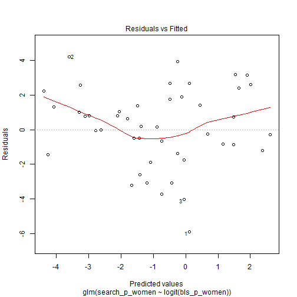

# Data and analysis for _Unequal representation and gender stereotypes in image search results for occupations_

<a rel="license" href="http://creativecommons.org/licenses/by/4.0/"></a> _Matthew Kay ([mjskay@uw.edu]
(mailto:mjskay@uw.edu)), Cynthia Matuszek ([cmat@umbc.edu]
(mailto:cmat@umbc.edu)), and Sean Munson ([smunson@uw.edu]
(mailto:smunson@uw.edu))_

This repository contains data and analysis code from: 

Kay, Matthew, Matuszek, Cynthia, and Munson, Sean. Unequal Representation and
Gender Stereotypes in Image Search Results for Occupations. _CHI 2015:
Proceedings of the SIGCHI Conference on Human Factors in Computing Systems_
(upcoming). http://dx.doi.org/10.1145/2702123.2702520

This file is structured as an extended version of the above paper, with inline
R code for running the analyses. It is generated by README.Rmd (an [RMarkdown]
(http://rmarkdown.rstudio.com/) file). The intent is to allow both for
reproduction of our analyses, as well as replication and extension of our
analyses. We would love to hear about any new analyses you conduct based on this
work, or problems/improvements you have with the analyses contained herein.
Please email us!

## Citing this work

Please cite the CHI paper above.

## Libraries needed for the analyses in this paper


```r
library(Matching)   #ks.boot
library(visreg)
library(boot)       #logit, inv.logit (could use qlogis/plogis but this is clearer) 
library(pscl)       #vuong
library(plyr)       #**ply
library(ordinal)    #clmm
```

# Unequal representation and gender stereotypes in image search results for occupations

## Abstract

Information environments have the power to affect people’s perceptions and
behaviors. In this paper, we present the results of studies in which we
characterize the gender bias present in image search results for a variety of
occupations. We experimentally evaluate the effects of bias in image search
results on the images people choose to represent those careers and on people’s
perceptions of the prevalence of men and women in each occupation. We find
evidence for both stereotype exaggeration and systematic underrepresentation of
women in search results. We also find that people rate search results higher
when they are consistent with stereotypes for a career, and shifting the
representation of gender in image search results can shift people’s perceptions
about real-world distributions. We also discuss tensions between desires for
high-quality results and broader societal goals for equality of representation
in this space.

## Introduction

Every day, billions of people interact with interfaces that help them access
information and make decisions. As increasing amounts of information become
available, systems designers turn to algorithms to select which information to
show to whom. These algorithms and the interfaces built on them can influence
people’s behaviors and perceptions about the world. Both algorithms and
interfaces, however, can be biased in how they represent the world [10,35].
These biases can be particularly insidious when they are not transparent to the
user or even to the designer [29]. The information people access affects their
understanding of the world around them and the decisions they make: biased
information can affect both how people treat others and how they evaluate their
own choices or opportunities.

One of the most prevalent and persistent biases in the United States is a bias
against women with respect to occupational choices, opportunities, and
compensation [21,27]. Stereotypes of many careers as gender-segregated serve to
reinforce gender sorting into different careers and unequal compensation for men
and women in the same career. Cultivation theory, traditionally studied in the
context of television, contends that both the prevalence and characteristics of
media portrayals can develop, reinforce, or challenge viewers’ stereotypes [30].

Inequality in the representation of women and minorities, and the role of
online information sources in portraying and perpetuating it, have not gone
unnoticed in the technology community. This past spring, Getty Images and
LeanIn.org announced an initiative to increase the diversity of working women
portrayed in the stock images and to improve how they are depicted [28]. A
recent study identified discrimination in online advertising delivery: when
searching for names, search results for black-identifying first names were
accompanied by more ads for public records searches than those for
white-identifying first names, and those results were more likely to suggest
searches for arrest records [35]. These findings raise questions about the
possible impacts of this discrimination and how to design technology in
consideration of issues such as structural racism.

Despite efforts to address some of these issues, there has been limited public
effort to measure how online information sources represent men and women.
Further, we do not know how people perceive these biases when they view
information sources, or the extent to which it affects their choices or
perceptions about the world. For example, are gender distributions in search
results representative of those in the real world – and if not, how does that
affect people’s perceptions of the world?

In this paper, we begin to address these gaps through four studies
characterizing how genders are represented in image search results for
occupations. We evaluate whether and how these biases affect people’s
perceptions of search result quality, their beliefs about the occupations
represented, and the choices they make. In a series of studies on existing image
search results, manipulated search results, and people’s perceptions of these
results, we investigate the following phenomena:

* _Stereotype exaggeration_: While gender proportions in image search results
  are close to those in actual occupations, results for many occupations exhibit
  a slight exaggeration of gender ratios according to stereotype: e.g.,
  male-dominated professions tend to have even more men in their results than
  would be expected if the proportions reflected real-world distributions. This
  effect is also seen when people rate the quality of search results or select
  the best image from a result: they prefer images with genders that match the
  stereotype of an occupation, even when controlling for qualitative differences
  in images.

* _Systematic over-/under- representation_: Search results also exhibit a
  slight under-representation of women in images, such that an occupation with
  50% women would be expected to have about 45% women in the results on average.
  However, when evaluating image result quality, people do not systematically
  prefer either gender: instead, stereotyping dominates, and they prefer images
  that match a given occupation’s gender stereotype.

* _Qualitative differential representation_: Image search results also exhibit
  biases in how genders are depicted: those matching the gender stereotype of a
  profession tend to be portrayed as more professional-looking and less
  inappropriate-looking.

* _Perceptions of occupations in search results_: We find that people’s
  existing perceptions of gender proportions in occupations are quite accurate
  (R<sup>2</sup> of 0.72), but that manipulated search results can have a small
  but significant effect on perceptions, shifting estimations on average ~7%.

This last point contributes to the broader motivation of this work: not only to
contribute to an understanding of how everyday information systems – here, image
search results – both reflect and influence perceptions about gender in
occupations, but also to characterize a possible design space for correcting or
adjusting for differences in representation. We do not take a stance on whether
or how designers and system builders should address gender inequality and its
effects in their systems, but we believe that designers should be aware of
inequalities in their systems and how those inequalities can affect perceptions.
We particularly note two overriding design tensions in this space: the desire to
improve perceived search result quality, and societal motivations for improving
equality of representation.

In the remainder of this paper, we review motivating work and our specific
research questions. We then describe four studies and their answers to these
research questions before discussing the implications for designers and society.

## Background and motivation

The Internet and large data sets create many new opportunities for engaging
with data and using it in communication and to support decision making. They
also come with challenges and pitfalls. A recent White House report noted that
biases in data collection and presentation can lead to flawed understandings of
the need for and use of public services, and that this can lead to
discrimination in who receives those services [9].

In the studies presented in this paper, we investigate the prevalence and risks
of gender-based stereotyping and bias in image search results for occupations.
Our research questions were guided by prior work in stereotyping and biases, the
role of media in forming, perpetuating, or challenging these, and contemporary
discussions of the effects of stereotypes and biases information environments.

### Stereotypes and bias 

A stereotype refers to a belief that individuals in a group – e.g., gender,
occupation, race, ethnicity, or particular background – generally have one or
more traits or behaviors. People make use of stereotypes to explain their own or
others’ behaviors [15,36], to justify actions or decide how to act [4,36], and
to define group boundaries [36]. While accurate stereotypes may be useful for
making decisions in the absence of more specific information, inaccurate
stereotypes can be harmful. Belief that one’s group performs poorly at a task
can lead to lower performance (stereotype threat [33]). Stereotyped expectations
about someone’s behavior can also lead them to behave in that way, a
self-fulfilling prophecy [33,39], and expectations about one’s own abilities can
influence aspirations and choices, such as beliefs about what career path one
should follow [7,8].

Bias arises when an individual, group or process unfairly and systematically
treats an individual or group favorably or unfavorably. Stereotypes about
abilities or character are a common source of bias [18], often to the
disadvantage of a particular race, sexual orientation, or gender. For example,
stereotypes about gender and parental roles can systematically limit women’s
career advancement [14,16,17].

### Effects of stereotypes and bias in the media

The portrayal of women and racial/ethnic minorities in television and other
media has received considerable attention as both a possible source of
stereotypes and opportunity to challenge them [12]. Exclusion of these groups
can imply that they are “unimportant, inconsequential, and powerless” [12].
Their inclusion offers specific examples whose implications depend on how they
are portrayed, and these portrayals can reinforce or challenge stereotypes.
Unfortunately, portrayals often reinforce negative stereotypes, for example by
showing racial/ethnic minorities as criminals, victims of criminals, and in
low-status service jobs [12].

Cultivation theory predicts that television’s portrayal of the world affects
people’s beliefs about reality [11,32]. Portrayals, or the lack of portrayals,
can affect whether people believe that people like them commonly participate in
an occupation, or their perceived self-efficacy for that role [12,32].
Researchers studying television commercials find that women are less likely to
be portrayed as workers and that they exaggerate gender-occupation stereotypes [6].
They express concern that such portrayals may perpetuate stereotypes.
Cultivation theory has also been found to predict how people perceive risks
after experiencing them in a video game [38], and playing a sexualized female
character reduces female players’ feelings of self-efficacy [3].

### Stereotypes and bias in information systems

Like media and other built systems or environments, computer systems have bias.
Friedman and Nissenbaum describe biased computer systems as those that
“systematically and unfairly discriminate against certain individuals or groups
of individuals in favor of others” [10]. They describe three categories:
preexisting bias (arising from biases present in individuals or society),
technical bias (arising from technical constraints), and emergent bias (arising
in real use, in which a system is mismatched for the capabilities or values of
its users). They argue: “freedom from bias should be counted among the select
set of criteria according to which the quality of systems in use in society
should be judged.”

Search engines have been studied and received popular attention for bias in
their results, both for what they index and present overall [20,37] and what they
present to particular users [29]. People tend to rely on search engines’
selection and ordering of results as signs of quality and relevance [22,23], and
so biased search results may affect people’s choices and beliefs. Scholars have
previously noted bias in which geographic locations are indexed and listed [37].
Others express concern that search autocomplete features could perpetuate
preexisting biases, noting that suggestions varied between different religious
groups, and sexual and racial minorities received more negatively framed
questions as suggestions [2]. As illustrated by these examples, a search engine
which has neither algorithms that systematically favor one group nor designers
with a particular bias can still perpetuate preexisting societal biases: a
representative indexing of biased source material will produce results that
contain the same biases.

More recently, Getty Images and Sheryl Sandberg’s Lean In Foundation announced
an effort to improve the depiction of working women in stock photos. They argue
that existing images support stereotypes of working women as sidelined,
sexualized, or in supporting roles, and that these depictions hurt women’s
career aspirations and prospects [13,25,28].

## Research questions

Motivated by these concerns and questions about them, we conducted a series of
studies to evaluate bias in image search results. Pre-existing biases that
affect the images available for image search systems, and algorithms designed to
represent available content, may lead to biased result sets, which in turn
affect people’s perceptions and choices among the search results. We
specifically focus on gender representation in image search results for
occupations. We choose the portrayal of occupations because it is a topic of
societal importance that has recently received attention and efforts to
ameliorate biases. While efforts such as the partnership between Getty Images
and Lean In may make more diverse or positive images available, and particularly
to those who access the Lean In collection, many people turn to major search
engines when looking to illustrate a topic, and so we focus our attention on the
image search results for a major search engine.

To the discussion of the bias in computer systems, we contribute an assessment
of the current extent and form of several forms of stereotyping and differences
of representation present in image search results: _stereotype exaggeration_,
_systematic over-/under-representation_, and _qualitative differential
representation_. We also explore the effects of these biases on perceptions of
the occupations in question. We designed four studies to answer these research
questions:

* Study 1: How does the prevalence of men and women in image search results for
  professions correspond to their prevalence in actual professions? Are genders
  systematically over or underrepresented across careers, and is there
  stereotype exaggeration in gender proportions?

* Study 2: Are there qualitative differences in how men and women are portrayed
  in the image search results?

* Study 3: Do biased image search results lead people to perpetuate a bias in
  image search results when they choose images to represent a profession (i.e.
  through stereotype exaggeration)? Are there systemic over- or
  under-representations of women in preferred results? How do differences in
  representation affect people’s perceptions of the search result quality?

* Study 4: Do differences in representation in image search results affect
  viewers’ perceptions of the prevalence of men and women in that occupation?
  Can we shift those opinions by manipulating results?

For all studies, we recruited turkers/participants<sup><a
name="footnote1_source" href="#footnote1">1</a></sup> from Amazon’s Mechanical
Turk microtask market. We required that they be from the United States (as our
occupation prevalence data is specific to that population) and, for studies 2-4,
required them to have the Masters qualification.

## Study 1: Gender proportions in results compared to actual proportions

In this study, we sought to characterize the extent to which the prevalence of
men and women in image search results for professions correspond to their actual
prevalence in those occupations. As a gold standard for actual prevalence of men
and women by occupation, we used estimates from the US Bureau of Labor and
Statistics (BLS) [5]. We did not use all occupations, but removed occupations
that:

* Presented difficult polysemy problems: for example, occupations that are
  listed as conjunctions of multiple occupations in the BLS, such as “Musicians,
  singers, and related workers”, are difficult to reduce to a single search.

* Had non-obvious search terms: for example, “Miscellaneous media and
  communication workers”.

* Are typically referred to using gender-specific terms: for example, “tailor”
  and “seamstress”

Most of the remaining terms had straightforward translations from BLS
categories into search terms for a worker in that occupation (for example, we
mapped “Nurse practitioners” in the BLS database to the search term “nurse
practitioner”). Some categories required limited interpretation (e.g., we
translated “Police and sheriff’s patrol officers” into “police officer”); for
these terms, all three authors had to agree on a corresponding search term for
the category to be included. This left us with 96 occupations having an entry in
BLS and a corresponding search term. The full BLS dataset is available in
`data/public/bls_occupations.csv` and the set of 96 occupations chosen for 
labelling is in `data/public/labelled_bls_occupations.csv`.

We then downloaded the top 100 Google Image search results for each search term
(from July 26–29, 2013). For each image, turkers were asked to indicate whether
there were no people, one person, or more than one person in the image. They
were also asked whether the people were women, men, children, or of unknown
gender (and to check all that apply).<sup><a name="footnote2_source"
href="#footnote2">2</a></sup> We had three turkers label each image. The 
mturk template for that task is available at `mturk/label_gender_task.html`.

### Results

#### Representativeness of filtered dataset
 
A requirement of this study was to obtain a representative dataset of images of
individuals in different occupations with properly labelled gender. This
required some filtering to ensure that images had correctly labelled genders,
depicted only people of that gender, and were generally images of people in the
first place. To label gender, we took the majority label for each image, and
dropped those images from the results which did not have majority agreement. We
then dropped entire search terms which:

* Had less than 80% of the images labelled with majority agreement (two terms
  failed this criterion: firefighter and baker; notably, firefighter had only
  64% agreement, largely because most of the images were dark silhouettes of
  uniformed firefighters with ambiguous gender, frequently labeled as “male” by
  some turkers).

* Had few images containing only one gender or that mostly depicted workers
  with clients/patients. For example, hairdresser was dropped since too many of
  its images contained both hairdresser and client, making it difficult to
  determine which gender label corresponds to which. We considered asking
  turkers whether the person in question has the given occupation; however, this
  implicitly asks them to decide if a person of that gender could be a
  hairdresser (thus potentially subject to gender stereotypes related to that
  profession, which would bias our labelled data set), so we opted to filter
  occupations with multiple genders in the majority of images.

* Had too few people in the image results; e.g., dishwasher largely returned
  images of dishwashing machines.

* Corresponded with a common name (e.g., baker returned many results of people
  with the surname Baker).

This second filtering process left us with 45 occupations. This dataset is
is `data/public/filtered_bls_occupations.csv`. To ensure that all
levels of our filtering (from the initial selection of search terms down to the
filtering of labelled images) had not biased the representativeness of our final
selection of occupations in terms of gender or ethnicity, we conducted a series
of Kolmogorov-Smirnov tests comparing the gender and ethnicity distributions of
the filtered 45 occupations to the entire set of 535 occupations in the BLS
(using bootstrap p values; unlike the traditional KS test this allows for
non-continuous distributions and ties):


```r
occupations = read.csv("data/public/bls_occupations.csv")
filtered_occupations = read.csv("data/public/filtered_bls_occupations.csv")

for (colname in c("p_women", "p_asian", "p_black", "p_hispanic")) {
    #plot CDF comparison for this group
    plot(ecdf(occupations[[colname]]), col="red", pch=NA, 
        main=paste("Comparison of ECDFs\nof", colname))
    lines(ecdf(filtered_occupations[[colname]]), verticals=TRUE, 
        pch=NA, col="black")
    legend("bottomright", c("Full", "Filtered"), col=c("red", "black"), 
        lty="solid", lwd=1, text.col="black", bty="n")
    
    #run KS test (default formatting leaves something to be desired,
    #so we'll give more detail ourselves here)
    ks.result = ks.boot(filtered_occupations[[colname]], occupations[[colname]])    
    cat("Two-sample Kolmogorov-Smirnov test\n",
        "Null hyp: distribution of ", colname, " for occupations in full dataset\n",
        "          is the same as the distribution of ", colname, 
        " for occupations in filtered dataset\n",
        "D_", nrow(filtered_occupations), ",", nrow(occupations), " = ", 
        ks.result$ks$statistic[1], "\n", sep="")
    print(summary(ks.result))
}
```

 

```
## Two-sample Kolmogorov-Smirnov test
## Null hyp: distribution of p_women for occupations in full dataset
##           is the same as the distribution of p_women for occupations in filtered dataset
## D_45,535 = 0.0996997
## 
## Bootstrap p-value:     0.769 
## Naive p-value:         0.82557 
## Full Sample Statistic: 0.0997
```

 

```
## Two-sample Kolmogorov-Smirnov test
## Null hyp: distribution of p_asian for occupations in full dataset
##           is the same as the distribution of p_asian for occupations in filtered dataset
## D_45,535 = 0.09009009
## 
## Bootstrap p-value:     0.837 
## Naive p-value:         0.90448 
## Full Sample Statistic: 0.09009
```

 

```
## Two-sample Kolmogorov-Smirnov test
## Null hyp: distribution of p_black for occupations in full dataset
##           is the same as the distribution of p_black for occupations in filtered dataset
## D_45,535 = 0.1021021
## 
## Bootstrap p-value:     0.731 
## Naive p-value:         0.80298 
## Full Sample Statistic: 0.1021
```

 

```
## Two-sample Kolmogorov-Smirnov test
## Null hyp: distribution of p_hispanic for occupations in full dataset
##           is the same as the distribution of p_hispanic for occupations in filtered dataset
## D_45,535 = 0.1423423
## 
## Bootstrap p-value:     0.34 
## Naive p-value:         0.39797 
## Full Sample Statistic: 0.14234
```

We did not find evidence that our filtered dataset significantly differed from
the set of occupations in the BLS in terms of gender distribution, distribution
of Asian people, distribution of Black or African American people, or
distribution of Hispanic or Latino people. Note the close correspondence of
empirical cumulative distribution functions for the filtered dataset versus the
full BLS dataset.

#### Misrepresentation of genders in search results

We ran several models to assess the possibility of systematic differences of
representation in depictions of occupations in image search results compared to
the known proportions in the BLS. The purpose of these models was to assess the
presence of two potential forms of quantitative differences in representation.

The first is that gender proportions are exaggerated according to stereotypes
for each career (stereotype exaggeration). For example, if stereotyping occurs
in image results, we would expect a profession with 75% males in the BLS to have
more than 75% males in the image results. The second possibility is that there
is a systematic overrepresentation of one gender, across all careers, in the
search results.

#### Stereotype exaggeration by career

To assess whether men or women were over- or under-represented according to
stereotypes for careers, we ran two logistic regression models: a stereotyped
and a non-stereotyped model. The stereotyped model regressed the logit of the
proportion of women in the search results on the proportion of women in BLS:


```r
proportions = read.csv("data/public/filtered_bls_occupations_with_search_gender_proportions.csv")

#we set the x-intercept to -0.5 so that the model intercept
#represents deviation from equal representation (note that
#logit(0.5) = 0, so if there is no systematic over/under
#representation we would expect the intercept of this model to
#be ~0). This is mainly a convenience for the analysis below
#as even if we did not do this an equivalent model would result
#(just with slightly harder to interpret coefficients).
m.stereotyped = glm(search_p_women ~ I(bls_p_women - 0.5), 
    family=quasibinomial, data=proportions, weights=search_n)
```

This model exhibits an s-curve characteristic of the logit of a proportion and
indicative of stereotyping: extreme gender proportions in the BLS are pulled
even more to the extremes in the search results:


```r
#plot fit and points
visreg(m.stereotyped, scale="response", rug=FALSE)
points(search_p_women ~ bls_p_women, data=proportions, pch=20)
#add some reference lines
abline(coef=c(0,1), lty="dashed")
abline(v=.5, lty="dashed")
```

 

The non-stereotyped model regressed the logit of the proportion of women in the
search results on the logit of the proportion of women in BLS, thus not
exhibiting an s-curve:


```r
m.nonstereotyped = glm(search_p_women ~ logit(bls_p_women),
    family=quasibinomial, data=proportions, weights=search_n)

#plot fit and points
visreg(m.nonstereotyped, scale="response", rug=FALSE)
points(search_p_women ~ bls_p_women, data=proportions, pch=20)
#add some reference lines
abline(coef=c(0,1), lty="dashed")
abline(v=.5, lty="dashed")
```

 

While both models can account for a systematic over-representation of one
gender across careers, only the stereotyped model can account for the pulling at
the extremes characteristic of stereotyping by the typical gender of a career.

We found some evidence for stereotype exaggeration: the stereotyped model had
qualitatively better residual fit, which we can see by comparing plots of the
residual fits:


```r
plot(m.stereotyped, which=1)
```

 

```r
plot(m.nonstereotyped, which=1)
```

 

We can also compare the models using Vuong’s closeness test for model
fit:


```r
#N.B. we refit binomial models instead of quasibinomial because
#Vuong's test requires MLE-based models. We also use the
#direct (case-by-case) data rather than a data table of 
#proportions and counts because the vuong function requires it.
images = read.csv("data/public/gender_labelled_images.csv")
m.stereotyped.2 = glm(image_gender ~ I(bls_p_women - 0.5), family=binomial, data=images)
m.nonstereotyped.2 = glm(image_gender ~ logit(bls_p_women), family=binomial, data=images)

#stop if the coefficients of these models aren't the same as the models fit above
stopifnot(all.equal(coef(m.stereotyped), coef(m.stereotyped.2))) 
stopifnot(all.equal(coef(m.nonstereotyped), coef(m.nonstereotyped.2))) 

vuong(m.stereotyped.2, m.nonstereotyped.2)
```

```
## Vuong Non-Nested Hypothesis Test-Statistic: 1.545984 
## (test-statistic is asymptotically distributed N(0,1) under the
##  null that the models are indistinguishible)
## in this case:
## model1 > model2, with p-value 0.061054
```

The Vuong test also suggested that the stereotyped model had better fit. This
stereotyping effect can be seen as the overall s-shape of the data compared to a
line with slope = 1 (we would expect a line with slope = 1 if the data did not
exhibit stereotype exaggeration).
 
#### Systematic over-/under- representation across careers

We can estimate overrepresentation of a gender across careers from our logistic
regression model by testing to see if the coefficient of the intercept is
significantly different from 0 when the x-intercept is set to 50% women in the
BLS. Since we fit the model with that x-intercept already, it suffices to
examine the intercept of the fitted model:


```r
#regression model coefficients and confidence intervals
summary(m.stereotyped)
```

```
## 
## Call:
## glm(formula = search_p_women ~ I(bls_p_women - 0.5), family = quasibinomial, 
##     data = proportions, weights = search_n)
## 
## Deviance Residuals: 
##     Min       1Q   Median       3Q      Max  
## -6.5619  -1.4354   0.1609   1.5076   3.9135  
## 
## Coefficients:
##                      Estimate Std. Error t value Pr(>|t|)    
## (Intercept)           -0.2604     0.0971  -2.682   0.0103 *  
## I(bls_p_women - 0.5)   5.3307     0.3773  14.130   <2e-16 ***
## ---
## Signif. codes:  0 '***' 0.001 '**' 0.01 '*' 0.05 '.' 0.1 ' ' 1
## 
## (Dispersion parameter for quasibinomial family taken to be 4.467219)
## 
##     Null deviance: 1594.45  on 44  degrees of freedom
## Residual deviance:  204.08  on 43  degrees of freedom
## AIC: NA
## 
## Number of Fisher Scoring iterations: 4
```

```r
confint(m.stereotyped)
```

```
## Waiting for profiling to be done...
```

```
##                           2.5 %      97.5 %
## (Intercept)          -0.4511975 -0.07004516
## I(bls_p_women - 0.5)  4.6151838  6.09629887
```

```r
#coefficients as odds ratios
exp(coef(m.stereotyped))
```

```
##          (Intercept) I(bls_p_women - 0.5) 
##            0.7707274          206.5835542
```

```r
exp(confint(m.stereotyped))
```

```
## Waiting for profiling to be done...
```

```
##                           2.5 %      97.5 %
## (Intercept)            0.636865   0.9323517
## I(bls_p_women - 0.5) 101.006392 444.2106410
```

```r
#coefficients as percentages at 50% women
inv.logit(coef(m.stereotyped))
```

```
##          (Intercept) I(bls_p_women - 0.5) 
##            0.4352603            0.9951827
```

```r
inv.logit(confint(m.stereotyped))
```

```
## Waiting for profiling to be done...
```

```
##                          2.5 %    97.5 %
## (Intercept)          0.3890761 0.4824959
## I(bls_p_women - 0.5) 0.9901967 0.9977539
```

Indeed, we find that the intercept does have a significant effect in this
model (estimated effect: −0.26, 95% confidence interval: [−0.45, −0.07], t43 =
−2.68, p < 0.05);<sup><a name="footnote3_source" href="#footnote3">3</a></sup>
this effect can be seen in Figure 2 as a dip in the predicted proportion of
women in the search results at (50%, 50%). This effect corresponds to an odds
ratio of approximately 0.77 (95% CI: [0.64, 0.93]); this means that in a
profession with 50% women, we would expect about 45% of the images to be women
on average (95% CI: [38.9%, 48.2%]).

The particular combination of stereotype exaggeration and underrepresentation
of women that we see – slight pulling at the extremes and slight bias towards
male images – combine to affect male- and female-dominated professions
differently. In male-dominated professions (lower-left quadrant of stereotyped
model plot) both effects amplify each other, so a higher proportion of males
appear in search results than are in the BLS. By contrast, in female-dominated
professions (upper-right quadrant) these two effects essentially cancel each
other out, leading to a similar proportion of women in the search results as are
in the BLS.

## Study 2: Differences in qualitative representation

Search results can be biased even when their gender proportions are
representative. For example, in reviewing the images collected for Study 1, we
identified many examples of sexualized depictions of women who were almost
certainly not engaged in the profession they portrayed; we dub this the __sexy
construction worker problem__, as images of female construction workers in our
results tended to be sexualized caricatures of construction workers. We wished
to assess whether images that better match the stereotypical gender of a
profession were systematically portrayed as more or less professional,
attractive, or appropriate. Note that while there are many interesting
differences to unpack here, our primary focus is on assessing these
characteristics so that we can control for them in subsequent analysis.

### Methods

We used the top 8 male and female images from each profession, as these images
will be used again in study 3, below. Initially, we piloted a study in which
people were asked to give 5 adjectives describing the person in each image, but
found that this task was too difficult. We therefore opted to select 8
adjectives derived from our pilot results and our research questions:
attractive, provocative, sexy, professional, competent, inappropriate,
trustworthy, and weird. We then had turkers indicate on a 5-point scale
(strongly disagree to strongly agree) whether they felt each adjective described
the person in the picture. Each turker could rate each image at most once,
though no turker could rate more than 600 images. Each image was rated by at
least 3 turkers.

### Results

At a high level, we found that images showing a person matching the majority
gender for a profession tend to be ranked as slightly more professional-looking
and slightly less inappropriate than those going against stereotype.

### Adjective ratings

One would expect that men and women rate images differently; however, this is
not our focus here, so we have attempted to factor out these differences. We
conducted a series of mixed-effects ordinal logistic regressions to model how
turkers rated images for each adjective. We included the turker’s gender, the
image gender, and their interaction as fixed effects; we included the turker and
the image as random effects.<sup><a name="footnote4_source"
href="#footnote4">4</a></sup> This allows our models to account for (for
example) situations where women systematically rate men as more attractive than
men do. 


```r
adjective_ratings = read.csv("data/public/image_adjective_ratings.csv")

#make adjectives ordered factors
adjectives = colnames(adjective_ratings)[9:16]
adjective_ratings[,adjectives] = llply(adjective_ratings[,adjectives], function (adjective) 
    ordered(adjective, levels=c("strongly disagree", "disagree", "neutral", "agree", "strongly agree")))

#build a list mapping each adjective name onto its ordinal model
m.adjectives = llply(adjectives, function(adjective)
    clmm(adjective_ratings[[adjective]] ~ turker_gender * image_gender + (1|turker) + (1|image_url), 
        data=adjective_ratings))
names(m.adjectives) = adjectives
```

We used the coefficients of the image effect in each model as a
normalized rating for that adjective. These ratings have the effects of turker,
turker gender, image gender, and their interaction factored out and are all
approximately standard normally distributed.

### Stereotyping bias in qualitative ratings

We hypothesized that images matching the typical gender of a given profession
might be portrayed differently from images that do not match the typical gender
of that profession (as in the sexy construction worker problem). To assess the
whether this was the case, we ran linear mixed-effects regressions, each with
one of the adjective ratings derived above as the independent variable. Each
model included image gender, the image gender proportion in BLS (the % of people
in the BLS matching the gender of the image; e.g. for a male image of a
construction worker, this would be the % of construction workers who are male
according to the BLS), and the interaction of these two terms as fixed effects.
The models also included the occupation as a random effect. As noted above, we
are primarily interested in these factors as controls in Study 3 (below), so we
only summarize two high-level trends in the results here.

First, adjectives like professional (F1,623.6 = 36.6, p < 0.0001), competent
(F1,630 = 28.4, p < 0.0001), and trustworthy (F1,627.8 = 33.8, p < 0.0001) had
significantly higher ratings when the proportion of people in the BLS matching
the gender of the image was higher. Second, adjectives like inappropriate
(F1,635.2 = 20.4, p < 0.0001) or provocative (F1,635.12 = 4.38, p < 0.05) had
significantly lower ratings when the proportion of people in the BLS matching
the gender of the image was higher. In other words, we again we see an effect of
stereotyping exaggeration: images matching the gender stereotype of a profession
tend to be slightly more professional-looking and slightly less inappropriate
than those going against stereotype. The reason for this effect is unclear: it
may be that these images are rated less professional/appropriate because of
raters’ biases against images going against their stereotypes for those
professions. However, it may also be that these depictions are of lower quality
– examples of the sexy construction worker problem, where depictions against
stereotype are not true depictions of the profession at all.

## Study 3: Perceptions of search results

Having described the bias present in image search results for careers –
stereotype exaggeration and differences in representation – we next turn our
attention to whether these differences affect people’s appraisals of the quality
of search results and, in a hypothetical task, what image they choose to
represent an occupation. This is not a purely abstract problem: a textbook
publisher recently recalled a math textbook after discovering they had selected
an image from a pornographic film for the cover [19].

We generated synthetic sets of image search results for each occupation, in
which the gender balance was manipulated by re-ranking images from the original
search results. Each synthetic result had a different gender distribution, with
8 images in each result. For each search term we generated up to 7 synthetic
results: all men, all women, equal proportions, proportions from Google search,
proportions from the BLS, the reverse of the proportions from Google search, and
the reverse of the proportions in the BLS.

To ensure that the proportion of women in the BLS for a given search term does
not influence the proportion of images in the synthetic results for that search
term, synthetic subsets (other than equal) were only included if their
corresponding reversed subset could also be included (for example, if we had
enough women to make a synthetic search result with 6/8 images of women, but not
enough men to make a synthetic search result with 6/8 images of men, neither
synthetic result was included). This ensures that if gender has no effect on the
probability of an image being selected, the baseline probability of two images
of different gender being selected for any occupation will be the same: ⅛
(regardless of the gender ratio in that occupation).

To generate a subset with k women, we selected the top k female images from our
labelled dataset (in the order they appeared in the original Google image search
results) and the top 8-k male images. The images were displayed to participants
in the order they appeared in the original search results. Participants could
view one result set per occupation. This was to prevent participants from
realizing that we manipulated the gender proportions of the search results, as
they might if they saw multiple synthetic results for the same occupation with
very different gender distributions.

On viewing a result set, we asked participants to select one image to
illustrate the occupation for a hypothetical business presentation. We then
asked them to describe how well the image results matched the search term (the
occupation), in a drop down from 1 (very poor) to 5 (very good), and to describe
why they rated as they did.

### Image Selection Results

We used logistic regression to model the probability that a given image is
selected as the best result by a participant. Our model included image gender,
the image gender proportion in BLS (see explanation under Study 2), participant
gender, and their interactions. We also included all of the image adjective
ratings to control for differences in qualitative representation. Results are
shown in Table 1.

#### Over-/under- representation and participant effects

We found no evidence of systematic over-/under- representation of either gender
(there were no significant effects of image gender). Neither were there
significant effects of participant gender (suggesting men and women generally
judge the best search result in the same way), nor any significant interactions
with either of these factors.

#### Stereotype exaggeration

As with the gender distributions in the search results themselves, we found
evidence of stereotyping when people choose image results: image gender
proportion in BLS had a significant effect on the probability of an image being
selected; i.e., an image matching the majority gender proportion of its
occupation was more likely to be selected. We believe this is consequence of
stereotype matching: an image matching a person’s stereotype for that gender is
more likely to be selected as an exemplar result.

```Table 1. Factors affecting image selection in Study 3. Coefficients are on a
logit scale. Note the stereotype effect: greater % image gender in BLS is
associated with higher probability that an image is selected.```

```Table 2. Factors affecting search result quality ratings in Study 3.
Coefficients are on a logit scale.```

### Search Result Quality Rating Results

We saw very similar effects influencing quality rating. We ran a mixed effects
ordinal logistic regression to model quality rating based on proportion of women
in BLS, proportion of women in the synthetic search result, participant gender,
and their interactions. We included the mean of the image adjective ratings in
the synthetic search result to control for differences in qualitative
representation. We also included participant and search term (occupation) as
random effects. Results are in Table 2.

#### Over-/under- representation and participant effects

As above, we found no significant over-/under-representation effect: in an
occupation with 50% women, we would not expect an all-male search result to be
rated differently from an all-female search result (estimated difference =
−0.41, SE = 0.47, z = −0.87, p = 0.38). As above, there were no significant
effects of participant gender.

#### Stereotype exaggeration

We again saw a stereotype exaggeration effect, manifested here as a significant
interaction between proportion of women in BLS and proportion of women in the
search result: in male-dominated occupations, search results with more males are
preferred; in female-dominated occupations, search results with more females are
preferred.

Viewed from the perspective of this task, these results make sense: we asked
people to select the best search result (or to rate the quality of all results),
and they tended to prefer images matching their mental image of each profession,
both in qualitative characteristics and in expected gender. This reflects the
strong sense that people have of expected gender proportions in a broad spectrum
of occupations, which we explore in more detail next. This also emphasizes an
important tension between possible broader societal goals in manipulating gender
as a design dimension in search results versus end-users’ quality expectations,
an issue we discuss in detail at the end of this paper.

## Study 4: Perceptions of gender proportions in occupations

Finally, we sought to understand whether and how gender proportions in image
search results can affect people’s perceptions of the actual prevalence of men
and women in different occupations, both to understand how existing
(stereotype-exaggerating, misrepresented) results might be affecting people’s
perceptions of gender proportions and how feasible manipulating gender
distributions in image search might be as a method for affecting those
perceptions. This gets at a primary motivation of our paper: opening up gender
proportions as a design dimension in image search.

Given the many possible day-to-day influences on perceptions of the prevalence
of genders in different fields, we chose to collect people’s baseline
perceptions, wait two weeks, show them a synthetic image search result set for
the same career, and then immediately ask them their perceptions of prevalence.

We asked each participant the demographics information we used in studies 2 and
3. Then for each career we asked what percent of people working in that career
in the US are women, alongside three distraction questions: what education they
believe is typical for someone in that career, whether they believe the career
was growing, and how prestigious they think it is. Participants could answer for
as many careers as they wished.

After two weeks, each participant received an email thanking them for their
prior participation and inviting them to participate in a new round of tasks; we
limited access both in the script that managed our tasks and using an assigned
qualification on Mechanical Turk. For each profession to which they had
previously responded, we returning participants to view a synthetic search
result and complete the image search task from study 3; on the next page we
re-asked the four questions from the first page: typical education for the
career, percent women, whether the career was growing, and its prestige.

### Results

#### Perceptions absent influence

People’s initial perceptions of gender proportions in occupations are quite
good. We assessed the correlation of their existing perceptions to real-world
proportions using a mixed-effects linear regression with gender proportions in
BLS as the fixed effect and participant as a random effect. The marginal
pseudo-R<sup>2</sup> of this model was 0.717 (F1,297.71 = 870.21, p < 0.0001).

#### Perceptions after influence

```Table 3. Effects of the manipulated search result and a person’s pre-existing
opinion of % women in an occupation on their opinion after seeing the
manipulated result (Study 4).```

After exposure to search results with manipulated gender proportions, estimates
shifted slightly in the direction of the manipulated proportions. We ran a
linear mixed-effects regression to predict perceived gender proportions, with
initial perceived gender proportion and manipulated search gender proportion as
fixed effects and participant as a random effect. Both fixed effects were
significant: while a person’s original perceptions of an occupation dominated
their opinion two weeks later; approximately 7% of a person’s subsequent opinion
on average was determined by the result set they were exposed to (p < 0.01, see
Table 3).

While this only shows short-term movement due to manipulated search results,
cultivation theory suggests that long-term, ongoing exposure to such results
might shift perceptions over time. This suggests that there may be value in
considering gender distribution as a more deliberate design dimension in image
search results, as we discuss next.

## Discussion 

Our results provide guidance on the short-term effects of possible changes to
search engine algorithms and highlight tensions in possible designs of search
algorithms.

### As a design space, what other kinds of search results could we design and what might be the consequences?

There are two sets of adjustments that can be made: adjusting the gender
distribution, and adjusting the distribution of qualitative image
characteristics within genders (e.g. increasing the proportion of female
construction worker results that are rated as professional or competent to
correct for the sexy construction worker problem). Taking the former as a
starting point, we outline three possible (amongst many) ways of adjusting
search results: 1) exaggerating, or continuing to accept, exaggerated gender
stereotypes; 2) aligning the gender balance of results to match reality; or 3)
balancing the genders represented in results.

These models also surface several design tensions in this space. In particular,
we might ask if our goal is to improve perceptions of search result quality, or
to advance a broader social agenda to shift perceptions of gender equality in
various professions. While potentially at odds in the short term (e.g., highly
stereotyped results might be highly rated but not have desirable societal
effects), cultivation theory also suggests these goals may not be as contrary
over the long term if perceptions can be shifted to match a broader goal of
equal representation (as, at least in the short term, Study 4 suggests is
possible). We discuss how these motivations interact in more detail for each
proposed model. We do not wish to come down on any side of these issues, but
wish to advance an understanding of how the choices people make in designing
algorithms can (and already do) define a design space that explicitly or
implicitly affects these issues.

1. __Stereotype model__. Exaggerate gender stereotypes. This might improve
subjective assessment of quality over baseline results if the dominant gender is
already represented as professional and appropriate, so would likely not require
correcting for qualitative differences (simplifying the technical problem). This
would also give more exemplars for the selection task. At the same time,
continuing to portray careers as more gender segregated than they are, or even
further exaggerating gender imbalances, has the disadvantage of potentially
influencing people’s perceptions of occupation gender distributions over time to
be less accurate and reinforcing stereotypes that can shape and limit career
aspirations and treatment.

2. __Reality model__. Correct the slight stereotype exaggeration and
underrepresentation of women seen in the data so that gender distributions
better resemble the BLS. So long as we can select images of the non-dominant
gender that have high professionalism and low inappropriateness, this would at
least better represent the reality of the profession while having little effect
on the perceived search result quality or the selection task. Over the long
term, exposure to such results might improve people’s estimations of real-world
gender proportions in occupations. This also represents only a small
perturbation to existing results, and may not even require adjustments to
distributions to account for qualitative differences in representation due to
how close the existing search proportions are to actual BLS proportions.

3. __Balanced model__. Adjust the gender proportions in occupations to be equal or
closer to equal. This may impair the selection task by giving fewer gender
exemplars. However, if this is paired with corrections for qualitative
differences in representation so that portrayals of the non-dominant gender are
similar to the dominant one (particularly for professionalism), we do not
believe it would significantly degrade people’s overall perceptions of the
quality of the results. This model exposes a tension between a desire for
results perceived as high-quality and possible societal goals for advancing
equal representation. While the short-term effects on perceived search result
quality would likely be negative, both cultivation theory [32] and the results of
study 4 predict that this could, in the long term, shift people’s perceptions
towards a less gender-stereotyped view of these professions. Along with that
long-term shift, a possible result may be that perceptions of quality shift back
as people begin to perceive gender proportions as more equal.

### Feasibility of Manipulating Representation

Automatic gender classification of images of people is an outstanding problem.
While state-of-the art classifiers perform well under certain circumstances,
they have historically focused on straight-on images of a single face, typically
without visual occlusions, uneven lighting, or complicated backgrounds [26].
However, recent studies on gender classification on images collected in the wild [1,31]
or of only partial features [24] strongly suggest that automated solutions will
soon reach or surpass the accuracy of human annotators. Meanwhile, automated
human labelling of these images would not be much more costly than the data
collection processes used in this paper, and would provide ground truth data for
future automated approaches.

### Limitations and Future Work

We have focused here on search results absent personalization or other
additional context (such as time of year or location) that may affect results
shown to users in real-world tasks. While the businessperson making a slide
presentation might be seeking an accurate depiction of a given profession, other
users with different goals might prefer caricatured or inaccurate portrayals,
such as the sexy construction worker. We also do not address the cause of the
biases and misrepresentation found (e.g., are these due to actual prevalence in
webpages, or due to the ranking algorithms used by Google?). Future work might
try to tease these effects apart, and to investigate these phenomena in other
types of image search, such as on photo sharing sites and in social media. To
aid in replication, our data and code are available online 
[here](https://github.com/mjskay/gender-in-image-search).

## Conclusion

Academics and the technology community have raised concerns about potential
biases in search engines and in stock photos. We contribute an assessment of
gender representation in image search results and its effects on perceived
search result quality, images selected, and perceptions about reality. We find
that image search results for occupations slightly exaggerate gender stereotypes
and portray the minority gender for an occupational less professionally. There
is also a slight underrepresentation of women. This stereotype exaggeration is
consistent with perceptions of result quality – people believe results are
better when they agree with the stereotype – but risks reinforcing or even
increasing perceptions of actual gender segregation in careers.

Addressing concerns such as these in search engines and other information
sources, however, requires balancing design tensions. For example, maintaining
perceived search quality and accurately representing available materials may be
at odds with supporting socially desirable outcomes and representing either
real-world distributions of careers or idealized distributions of careers. We
hope to advance a constructive discussion on gender representation as a design
dimension (explicit and implicit) in information systems.

## Acknowledgements

We thank Gilbert Bernstein and Benjamin Mako Hill for their valuable feedback
on this work.

## Footnotes

1. <a name="footnote1" href="#footnote1_source">\^</a> We use “turkers” for
   studies 1 and 2, where they were asked only to label data, and “participants”
   for studies 3 and 4, where their opinions and perceptions were
   solicited.</span>

2. <a name="footnote2" href="#footnote2_source">\^</a> As the BLS uses only
   binary gender classifications, we also restricted labels to binary gender
   classification here.
   
3. <a name="footnote3" href="#footnote3_source">\^</a> This test was carried out
   using the stereotyped model, but we note that a similar test carried out on
   the non-stereotyped model yielded similar results and confidence intervals.

4. <a name="footnote4" href="#footnote4_source">\^</a> While we have used worker
   and image as random effects here and elsewhere in the paper, where estimable
   we have also compared results with fixed effects models and found similar
   effects. We believe random effects to be more appropriate here as some
   workers have completed only a small number of tasks.

## References

1.  Arigbabu OA; Ahmad SMS, Adnan WAN, Yussof S, Iranmanesh V, Malallah, FL,
    Gender recognition on real world faces based on shape representation and
    neural network. ICCOINS 2014.

2.  Baker P, Potts A. “Why do white people have thin lips?” Google and the
    perpetuation of stereotypes via auto-complete search forms. Crit Disc St
    10(2): 187-204.

3.  Behm-Morawitz E, Mastro D. The Effects of the Sexualization of Female Video
    Game Characters on Gender Stereotyping and Female Self-Concept. Sex Roles
    2009; 61(11-12): 808-823.

4.  Bodenhausen GV, Wyer RS. Effects of stereotypes in decision making and
    information-processing strategies. J Pers Soc Psychol 1985; 48(2): 267.

5.  Bureau of Labor Statistics. Labor Force Statistics from the Current
    Population Survey, Section 11. 5 February 2013.
    http://www.bls.gov/cps/aa2012/cpsaat11.htm.

6.  Coltrane S, Adams M. Work–family imagery and gender stereotypes: Television
    and the reproduction of difference. J Vocat Behav 1997; 50(2): 323-347.

7.  Correll SJ. Gender and the career choice process: The role of biased
    self-assessments. Am J Sociol 2001; 106(6): 1691–1730.

8.  Correll SJ. Constraints into preferences: Gender, status, and emerging
    career aspirations. Am Sociol Rev 2004; 69(1): 93-113.

9.  Executive Office of the President. Big Data: Seizing Opportunities,
    Preserving Values. May 2014.

10. Friedman B, Nissenbaum H. Bias in computer systems. ACM T Inform Syst 1996;
14(3): 330-347.

11. Gerbner G, Gross L, Morgan M, Signorielli N. Living with television: The
dynamics of the cultivation process. Perspectives on media effects 1986: 17-40.

12. Graves SB. Television and Prejudice Reduction: When Does Television as a
Vicarious Experience Make a Difference? J Soc Issues 1999; 55(4): 707-727.

13. Grossman P. New Partnership with LeanIn.org. InFocus by Getty Images.
http://infocus.gettyimages.com/post/new-partnership-with-leaninorg.

14. Halpert JA, Wilson ML, Hickman JL. Pregnancy as a source of bias in
performance appraisals. J Organ Behav 1993.

15. Haslam SA, Turner JC, Oakes PJ, Reynolds KJ, Doosje, B From personal
pictures in the head to collective tools in the word: how shared stereotypes
allow groups to represent and change social reality. In C McGarty, VY Yzerbyt, R
Spears (eds.). Stereotypes as explanations: The formation of meaningful beliefs
about social groups 2002. Cambridge University Press, 157-185.

16. Heilman ME. Description and prescription: How gender stereotypes prevent
women's ascent up the organizational ladder. J Soc Issues 2001; 57(4): 657-674.

17. Heilman ME. Okimoto, TG. 2008. Motherhood: A potential source of bias in
employment decisions. J Appl Psychol 2008; 93(1): 189-198.

18. Hilton JL, & Von Hippel W. Stereotypes. Annu Rev Psychol 1996; 47(1):
237-271.

19. Hooper B. Porn star appears on cover of Thai math textbook. United Press
International. http://upi.com/5031410787947

20. Introna L, Nissenbaum H. Defining the web: The politics of search engines.
Computer 2000; 33(1): 54-62.

21. Jacobs J. Gender Inequality at Work. Thousand Oaks, CA: SAGE Publications,
1995.

22. Kammerer,Y, Gerjets P. How search engine users evaluate and select Web
search results: The impact of the search engine interface on credibility
assessments. Libr Inform Sci 2012; 4: 251–279.

23. Keane MT, O'Brien M, Smyth B. Are people biased in their use of search
engines? Commun ACM 2008; 51(2): 49-52.

24. Khorsandi R, Abdel-Mottaleb M. Gender classification using 2-D ear images
and sparse representation. 2013 IEEE Workshop on Applications of Computer Vision
(WACV), 461-466.

25. Lean In Foundation. Getty Image Collection. http://leanin.org/getty.

26. Makinen E, Raisamo R. Evaluation of Gender Classification Methods with
Automatically Detected and Aligned Faces, IEEE T Pattern Anal 2008; 30(3):
541-547.

27. Massey D. Categorically Unequal: The American Stratification System. NY:
Russell Sage Foundation, 2007.

28. Miller CC. 10 February 2014. LeanIn.org and Getty Aim to Change Women’s
Portrayal in Stock Photos. New York Times, B3. http://nyti.ms/1eLY7ij

29. Pariser E. The Filter Bubble: What the Internet Is Hiding from You. 2011.
Penguin Press.

30. Potter WJ. Cultivation theory and research, Hum Commun Res 1993; 19(4):
564-601.

31. Shan C. Learning local binary patterns for gender classification on
real-world face images, Pattern Recogn Lett 2012; 33(4), 431-437.

32. Shrum LJ. Assessing the Social Influence of Television A Social Cognition
Perspective on Cultivation Effects. Commun Res 1995; 22(4): 402-429.

33. Spencer SJ, Steele CM, Quinn DM. Stereotype threat and women's math
performance. J Exp Soc Psychol 1999; 35(1): 4-28.

34. Snyder M, Tanke ED, Berscheid E. Social perception and interpersonal
behavior: On the self-fulfilling nature of social stereotypes. J Pers Soc
Psychol 1977; 35(9): 656–666.

35. Sweeney L. Discrimination in online ad delivery. Commun ACM 2013; 56(5):
44-54.

36. Tajfel H. Social stereotypes and social groups. In Turner JC, Giles H.
Intergroup Behaviour 1981. Oxford: Blackwell. 144–167.

37. Vaughan L, Thelwall M. Search engine coverage bias: evidence and possible
causes. Inform Process Manag 2004; 40(4): 693-707.

38. Williams D. Virtual Cultivation: Online Worlds, Offline Perceptions. J
Commun 1996; 56(1): 69–87.

39. Word CO, Zanna MP, Cooper J. The nonverbal mediation of self-fulfilling
prophecies in interracial interaction. J Exp Soc Psychol 1974; 10(2): 109–120.

40. X Tang, K Liu, J Cui, F Wen, X Wang. IntentSearch: Capturing User Intention
for One-Click Internet Image Search, IEEE T Pattern Anal 34(7): 1342-1353.

41. Zha ZJ, Yang L, Mei T, Wang M, Wang Z, Chua TS, Hua XS. 2010. Visual query
suggestion: Towards capturing user intent in internet image search. ACM T Multim
Comput 2010; 6(3): a13.
   
